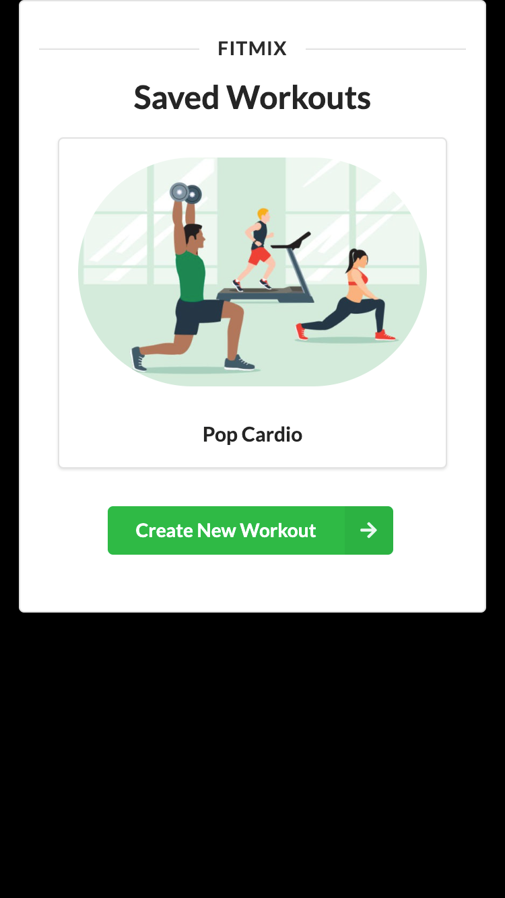
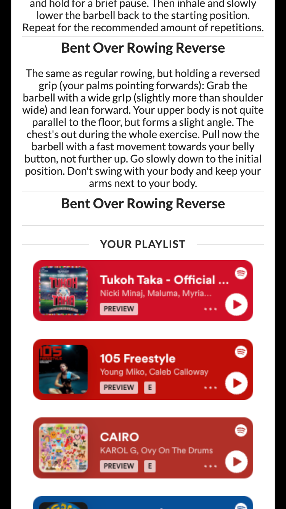
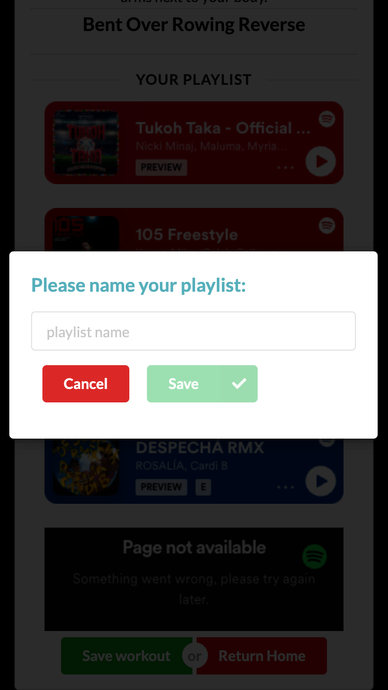

# FitMix

## Description

_Please note_: this application is in Developer Mode with Spotify's API. Playlist generation will not work unless access is requested. If you'd like to test the app, please contact me at: jsnicholas @ pm.me

FitMix is a workout and playlist generator that helps you get motivated in the gym.

Technologies used: Spotify Music and oEmbed APIs, wger Workout API, Semantic UI CSS Framework, Javascript, HTML, and jQuery.

This is a fork from the original project, which aims to make the Spotify implementation more secure and further utilize the Semantic UI framework. The original code can be found here: https://github.com/gabrielarec/FitMix

## Links

[GitHub repository](https://github.com/jsnicholas/FitMix)  
[Deployed Site](https://jsnicholas.github.io/FitMix/)

## Application Flow

Please see our application flow documentation below:
Application Flow:

To learn more about our application, please feel free to reference our presentation below:
https://docs.google.com/presentation/d/1xG20oh73wriI7COidxMGC3aCWvp3qsngkayhAI96Es4/edit?usp=sharing

## Collaborators

The primary team members who were involved in this were Nick Johnson, Drew Hart, Gabriela Reyna and Nabeel Khan.
Please see their GitHub portfolios below:

- [Nick Johnson](http://github.com/jsnicholas)
- [Gabriela Reyna](https://github.com/gabrielarec)
- [Nabeel Khan](https://github.com/nabeekha)
- [Drew Hart](https://github.com/loyallhart)

## Screenshots

## License

MIT License

Copyright (c) [2023]

Permission is hereby granted, free of charge, to any person obtaining a copy
of this software and associated documentation files (the "Software"), to deal
in the Software without restriction, including without limitation the rights
to use, copy, modify, merge, publish, distribute, sublicense, and/or sell
copies of the Software, and to permit persons to whom the Software is
furnished to do so, subject to the following conditions:

The above copyright notice and this permission notice shall be included in all
copies or substantial portions of the Software.

THE SOFTWARE IS PROVIDED "AS IS", WITHOUT WARRANTY OF ANY KIND, EXPRESS OR
IMPLIED, INCLUDING BUT NOT LIMITED TO THE WARRANTIES OF MERCHANTABILITY,
FITNESS FOR A PARTICULAR PURPOSE AND NONINFRINGEMENT. IN NO EVENT SHALL THE
AUTHORS OR COPYRIGHT HOLDERS BE LIABLE FOR ANY CLAIM, DAMAGES OR OTHER
LIABILITY, WHETHER IN AN ACTION OF CONTRACT, TORT OR OTHERWISE, ARISING FROM,
OUT OF OR IN CONNECTION WITH THE SOFTWARE OR THE USE OR OTHER DEALINGS IN THE
SOFTWARE.
